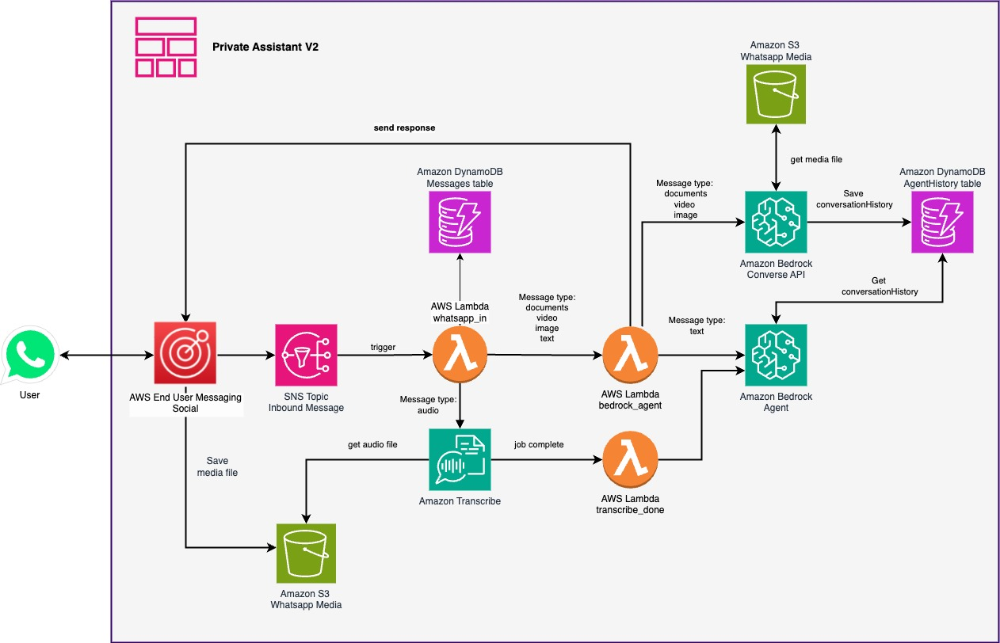

# Processing WhatsApp Multimedia with Amazon Bedrock Agents: Images, Video, and Documents

[Amazon Bedrock](https://aws.amazon.com/bedrock) can now process various content types through the [Amazon Nova Model](https://aws.amazon.com/ai/generative-ai/nova/), enabling you to create AI assistants that understand context across different media formats. This post will demonstrate how to build a WhatsApp assistant that analyzes images, processes videos, extracts information from documents, and transcribes audio messages—all while maintaining context throughout the conversation with [Amazon Bedrock Agents](https://aws.amazon.com/bedrock/agents/). 

You'll learn how to combine Amazon Bedrock with [AWS End User Messaging](https://aws.amazon.com/end-user-messaging/) for direct WhatsApp integration, creating a serverless solution that eliminates the need for additional API layers.

>Your data will be securely stored in your AWS account and will not be shared or used for model training. It is not recommended to share private information because the security of data with WhatsApp is not guaranteed.

| Voice notes | Image | 
|----------|------------|
||   |

>[Thanks User Group Montevideo for the photo](https://www.linkedin.com/posts/aws-ug-montevideo_meetups-aws-montevideo-activity-7297271247103549441-koU8?utm_source=share&utm_medium=member_desktop&rcm=ACoAAB5M4B8BnGWK9J1kpcrduy0KlkH3bvggG-E)  

| Video | Document |
|--------------|--------------|
|||

✅ **AWS Level**: Advanced - 300

**Prerequisites:**

- [AWS Account](https://aws.amazon.com/resources/create-account/?sc_channel=el&sc_campaign=datamlwave&sc_content=cicdcfnaws&sc_geo=mult&sc_country=mult&sc_outcome=acq) 
-  [Foundational knowledge of Python](https://catalog.us-east-1.prod.workshops.aws/workshops/3d705026-9edc-40e8-b353-bdabb116c89c/) 
- [AWS CLI configured](https://docs.aws.amazon.com/cli/v1/userguide/cli-chap-configure.html) with appropriate permissions.
- [Python 3.8](https://www.python.org/downloads/) or later.
- [AWS AWS Cloud Development Kit (CDK)](https://docs.aws.amazon.com/cdk/v2/guide/getting_started.html) v2.172.0 or later.
- [Have or create a Meta Business Account](https://docs.aws.amazon.com/social-messaging/latest/userguide/getting-started-whatsapp.html#getting-started-embedded)

## 🤔 How The App Works




### Infrastructure

The project uses [AWS AWS Cloud Development Kit (CDK)](https://aws.amazon.com/cdk/) to define and deploy the following resources:

- [AWS Lambda](https://docs.aws.amazon.com/lambda/latest/dg/welcome.html):
  - `whatsapp_in`: Processes incoming WhatsApp messages.
  - `transcriber_done`: Handles completed transcription jobs.
  - `bedrock_agent`: Invokes the Amazon Bedrock Agent.

- [Amazon Simple Storage Service (Amazon S3)](https://aws.amazon.com/s3/):
  - Bucket for storing media files (voice, image, video, document).

- [Amazon DynamoDB](https://aws.amazon.com/dynamodb/):
  - `messages`: Stores WhatsApp message data
  - `agenthistory`: Stores conversation history for the Amazon Bedrock Converse API, when image, documents and video is processing. 

- [Amazon Simple Notification Service (SNS)](https://aws.amazon.com/sns/):
  - Topic for receiving WhatsApp events.

- [AWS Identity and Access Management](https://aws.amazon.com/iam/):
  - Roles and policies for Lambda functions and Bedrock Agent.

- [Amazon Bedrock](https://aws.amazon.com/es/bedrock/):
  - Agent configured for processing messages.
  - Converse API invocation for processing documents, images and videos. 
  - Agent Alias for versioning.

- [Amazon Transcribe](https://aws.amazon.com/transcribe/):
  - Used for transcribing audio messages.

- [AWS End User Messaging](https://aws.amazon.com/end-user-messaging/)
  - Natively links WhatsApp Business Account (WABA) and AWS account. 

The infrastructure is defined in the `PrivateAssistantV2Stack` class within the `private_assistant_v2_stack.py` file.

### Data Flow
1. User sends a WhatsApp message.
2. Message is published to the SNS Topic.
3. `whatsapp_in` AWS Lambda function is triggered.
4. Message is processed based on its type:
   - **Text**: Sent directly to Amazon Bedrock Agent.
   - **Audio**: Transcribed using Amazon Transcribe, once the transcribe job is done.`transcriber_done` Lambda function is triggered and then sent the text to Amazon Bedrock Agent.
   - **Image/Video/Document**: Stored in S3, then analyzed by Amazon Bedrock Agent [converse API](https://docs.aws.amazon.com/bedrock/latest/APIReference/API_runtime_Converse.html), save the input and response as [ConversationHistory Contents](https://docs.aws.amazon.com/bedrock/latest/APIReference/API_agent-runtime_ConversationHistory.html) in an AgentHistory Amazon DynamoDB table.
5. `bedrock_agent` Lambda function processes the message and generates a response
6. Response is sent back to the user via WhatsApp.

### 💰 For pricing details, see: 
- [Amazon Bedrock Pricing](https://aws.amazon.com/bedrock/pricing/)
- [AWS Lambda Pricing](https://aws.amazon.com/lambda/pricing/)
- [Amazon Transcribe Pricing](https://aws.amazon.com/transcribe/pricing/)
- [Amazon S3 Pricing](https://aws.amazon.com/s3/pricing/)
- [Amazon DynamoDB Pricing](https://aws.amazon.com/dynamodb/pricing/)
- [AWS End User Messaging Pricing](https://aws.amazon.com/end-user-messaging/pricing/)
- [Amazon Simple Notification Service Pricing](https://aws.amazon.com/sns/pricing/)
- [Whatsapp pricing](https://developers.facebook.com/docs/whatsapp/pricing/)


### Key Files:
- `app.py`: Entry point for the CDK application.
- `private_assistant_v2_stack.py`: Main stack definition for the AI assistant.
- `lambdas/code/`: Contains Lambda functions for processing WhatsApp messages, invoking Bedrock Agent, and handling transcriptions.
- `layers/`: Contains shared code and dependencies for AWS Lambda functions.
- `agent_bedrock/create_agent.py`: Defines the Bedrock Agent configuration.

## 🧰 Usage Instructions

### Installation

⏱️ Estimated time to complete: 10-15 minutes

✅ **Clone the repository**:
   ```
   git clone https://github.com/build-on-aws/building-gen-ai-whatsapp-assistant-with-amazon-bedrock-and-python
   cd private_assistant_v2
   ```

✅ **Create and activate a virtual environment**:
   ```
   python3 -m venv .venv
   source .venv/bin/activate  # On Windows, use `.venv\Scripts\activate`
   ```

✅ **Install dependencies**:
   ```
   pip install -r requirements.txt
   ```

✅ **Synthesize The Cloudformation Template With The Following Command**:

```
cdk synth
```

✅ **The Deployment🚀**:

```
cdk deploy
```

> Note the output values, especially the SNS Topic ARN, which will be used for configuring the WhatsApp integration.

## 🧰 Configuration

### Step 0: Activate WhatsApp account Facebook Developers

1- [Get Started with the New WhatsApp Business Platform](https://www.youtube.com/watch?v=CEt_KMMv3V8&list=PLX_K_BlBdZKi4GOFmJ9_67og7pMzm2vXH&index=2&t=17s&pp=gAQBiAQB)

2- [How To Generate a Permanent Access Token — WhatsApp API](https://www.youtube.com/watch?v=LmoiCMJJ6S4&list=PLX_K_BlBdZKi4GOFmJ9_67og7pMzm2vXH&index=1&t=158s&pp=gAQBiAQB)

3- [Get started with the Messenger API for Instagram](https://www.youtube.com/watch?v=Pi2KxYeGMXo&list=PLX_K_BlBdZKi4GOFmJ9_67og7pMzm2vXH&index=5&t=376s&pp=gAQBiAQB)

### Step 1: APP Set Up 
Set up a WhatsApp Business account by follow the [Getting started with AWS End User Messaging Social steps](https://docs.aws.amazon.com/social-messaging/latest/userguide/getting-started-whatsapp.html and configure it to send messages to the [SNS Topic](https://console.aws.amazon.com/sns/home) created by this stack.

> You can also follow the more detailed steps in [Automate workflows with WhatsApp using AWS End User Messaging Social blog](https://aws.amazon.com/es/blogs/messaging-and-targeting/whatsapp-aws-end-user-messaging-social/).

### Step 2: Customize the Bedrock Agent's behavior (optional).
Update the `agent_data.json` file in the `private_assistant_v2/` directory to customize the Bedrock Agent's behavior.

### Step 3: Adjust environment variables (optional).
3. Adjust environment variables in `private_assistant_v2_stack.py` if needed, such as S3 bucket prefixes or DynamoDB table names.

## Testing

To test the AI assistant:

1. Send a WhatsApp message to the configured phone number.
2. The message will be processed by the `whatsapp_in` Lambda function.
3. For text messages, the Bedrock Agent will be invoked directly.
4. For audio messages, they will be transcribed using Amazon Transcribe before being sent to the Bedrock Agent through the `bedrock_agent` Lambda function.
5. For images, videos, and documents, they will be stored in S3 and analyzed by the Bedrock converse API through the `bedrock_agent` Lambda function.
6. The assistant's response will be sent back to the user via WhatsApp.

## 🧹 Clean up:
If you finish testing and want to clean the application, you just have to follow these two steps:

1. Delete the files from the Amazon S3 bucket created in the deployment. 
2. Run this command in your terminal:

```
cdk destroy
```

## 📚 Some links for more information:

- [Automate workflows with WhatsApp using AWS End User Messaging Social](https://aws.amazon.com/es/blogs/messaging-and-targeting/whatsapp-aws-end-user-messaging-social/) 
- [Automate Workflows with WhatsApp using AWS End User Messaging Social](https://github.com/aws-samples/generative-ai-ml-latam-samples/blob/main/samples/whatsapp-eum-connect-chat/README.md#whatsapp-integration-with-amazon-connect-with-voice-notes)
- [WhatsApp Integration with AWS End User Messaging and Amazon Bedrock](https://github.com/aws-samples/generative-ai-ml-latam-samples/tree/main/samples/end-user-messaging-bedrock#whatsapp-integration-with-aws-end-user-messaging-and-amazon-bedrock)

---

## 🇻🇪🇨🇱 ¡Gracias!

[Eli](https://www.linkedin.com/in/lizfue/)

---

## Security

See [CONTRIBUTING](CONTRIBUTING.md#security-issue-notifications) for more information.

## License

This library is licensed under the MIT-0 License. See the LICENSE file.